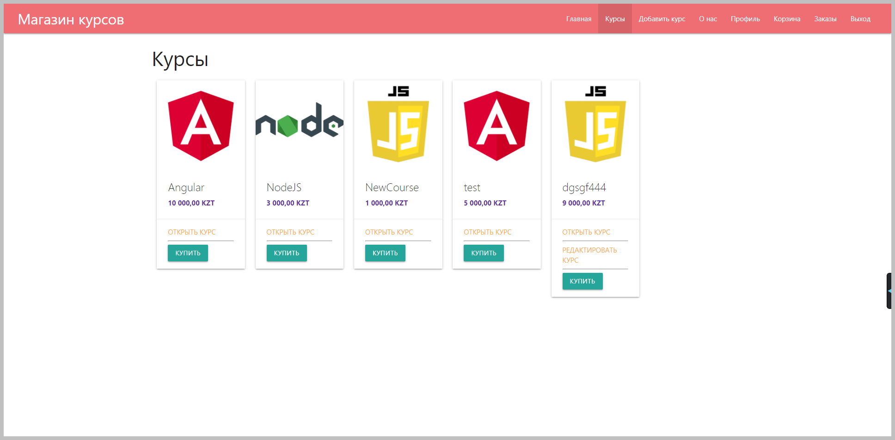
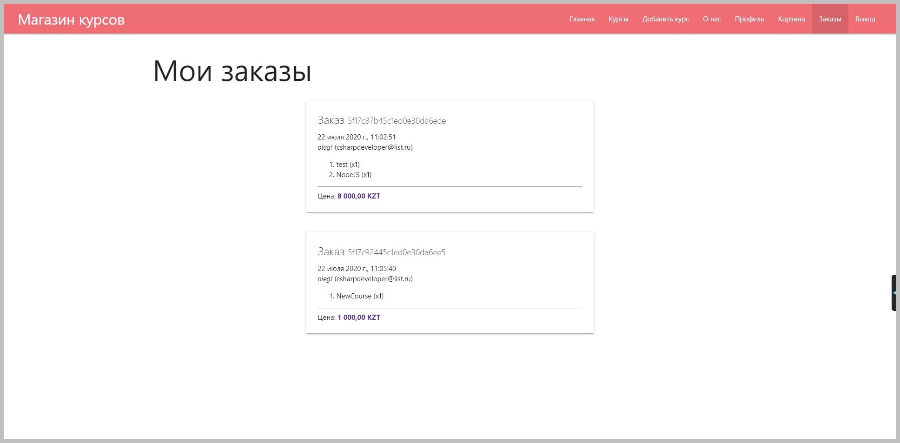
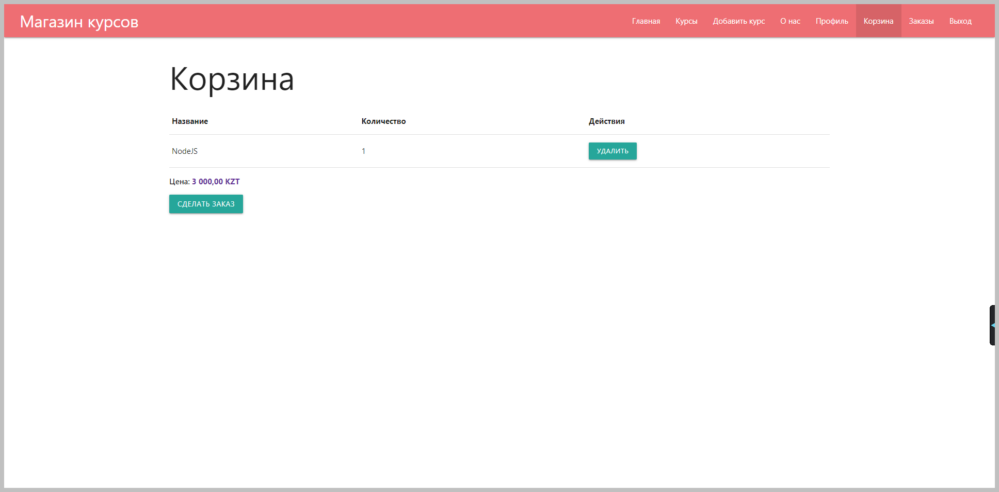
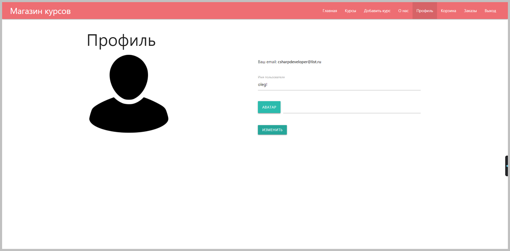

# Store Courses

# Table of Contents
1. [Раздел список курсов](#storeList)
2. [Example2](#example2)
3. [Example2](#example2)
4. [Third Example](#third-example)

##Раздел список курсов <a name="storeList"></a>

```
    Позволяет просмотривать курсы, добавлять в корзину покупок, а так же редактировать свои добавленные курсы.
```

​

## Раздел вход или регистрация

```
    Позволяет авторизоваться на сайте, воспользоваться ссылкой забыл пароль (на почту приходит письмо для сброса пароля) а также зарегистрироваться новому пользователю.
```

​

## Раздел Добавить Курс

```
    Позволяет авторизованному пользователю добавить свой курс в систему.
```

​

## Раздел Заказы

```
    Позволяет авторизованному пользователю просматривать историю своих заказов.
```

​

## Раздел Корзина покупок

```
    Позволяет авторизованному пользователю просматривать корзину покупок и совершать заказ.
```

​

## Раздел Профиль
```
    Позволяет авторизованному пользователю редактировать свое имя и аватар.
```

​